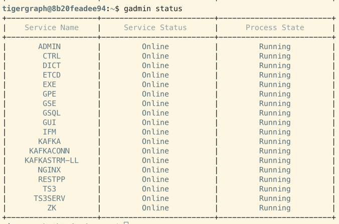
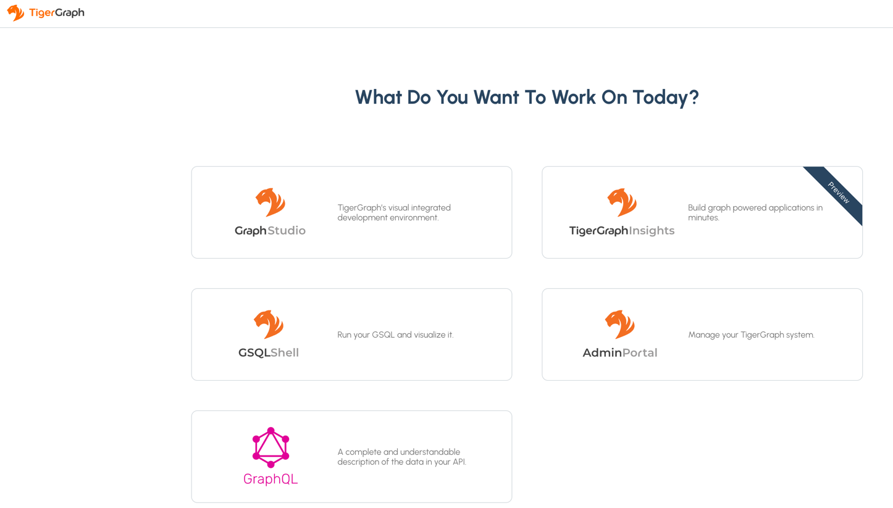
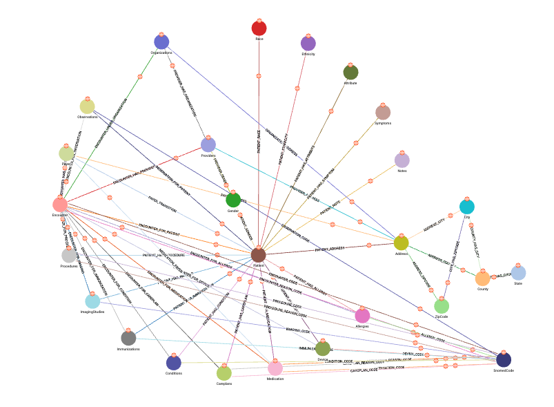
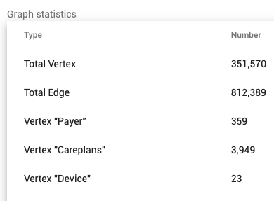
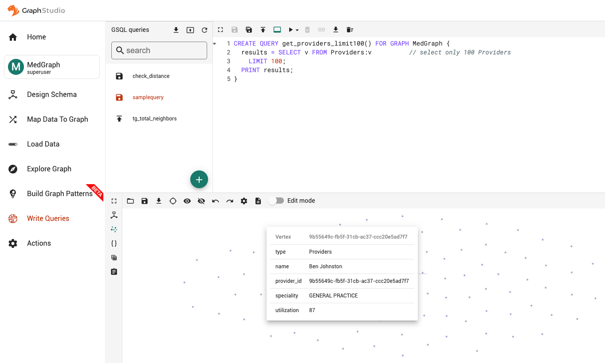

import styles from '../css/newsfeed.css';

## Setup SyntheaDB Healthcare Graph in Local Docker Environment

Author: Raghavi Janaswamy

Date published: 2/14/2023

Date last updated: 2/14/2023

The use of graph databases has been rapidly growing in recent years as an alternative to traditional database solutions, such as relational database. Graph databases are particularly useful for the complex data models used in the healthcare domain. Large scale complex data analytics that were previously unachievable are made possible using graph db. The benefits of graph technologies as they pertain to healthcare are discussed in this article – [Benefits of Graph Databases](./graph-benefits.md).

There are several commercial implementations of Graph data models like Tigergraph, Neo4j, and DataStax Graph. This article discusses the steps to setup the local docker dev environment with Tigergraph, create a schema for healthcare graph, and load the synthetic data from SyntheaDB.

### Pre-requisites

- Able to run the Python notebook
  - Download Anaconda Python distribution and create a new environment with dependencies
- Docker desktop application is setup

### Setup Tigergraph Graph in local environment (Docker)

Setup **Tigergraph** in the local environment as per the directions from the link - [setup Tigergraph](https://docs.tigergraph.com/tigergraph-server/current/getting-started/docker).

#### Checkpoint -  leverage 'gadmin' command-line tool to start and verify the services status

<body>

</body>

#### Verify all services are up and running

<body>

</body>

#### Verify the Tigergraph GUI is up and running at [localhost:14240](http://localhost:14240/)

### Create the Healthcare graph schema in Tigergraph

Run the loadLocalSchema.pynb from the [https://github.optum.com/rjanaswa/syntheadb-healthcaregraph](https://github.optum.com/rjanaswa/syntheadb-healthcaregraph) to create a schema in the local Tigergraph.

The **MedGraph** schema gets created as shown below.

### Load the Healthcare graph data

The SyntheaDB data files can be extracted from [https://github.com/TigerGraph-DevLabs/Synthea-Medgraph](https://github.com/TigerGraph-DevLabs/Synthea-Medgraph).

Run the loadLocalData.pynb from the [https://github.optum.com/rjanaswa/syntheadb-healthcaregraph](https://github.optum.com/rjanaswa/syntheadb-healthcaregraph) to load the synthetic healthcare data in the local Tigergraph.

The graph statistics can be found from the [localhost:14240](http://localhost:14240) as below:

<body>

</body>

### Next steps

Now that your data has been loaded into the graph database, you can explore the data and run queries using the Graph Studio environment.

Here is a sample GSQL query that you can install and run from Graph Studio from the [http://localhost:14240/studio/#/query-editor](http://localhost:14240/studio/#/query-editor).

<body>

</body>

Once you have completed these steps, you can also run more advanced graph analytics such as the one described in -  [Rare Disease Classification with Graph Neural Network](./raredisease-prediction-gnn-pytorch.md).
